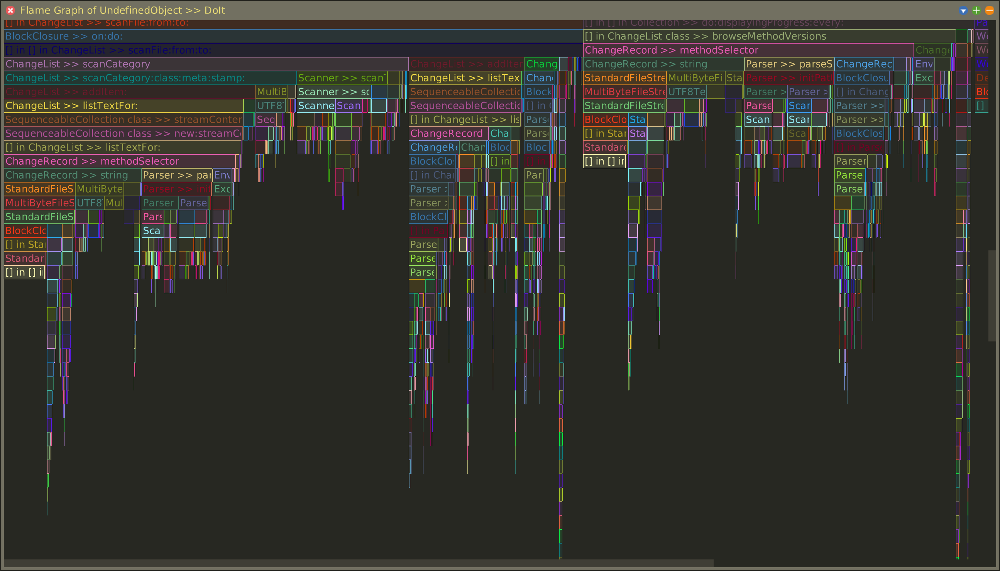
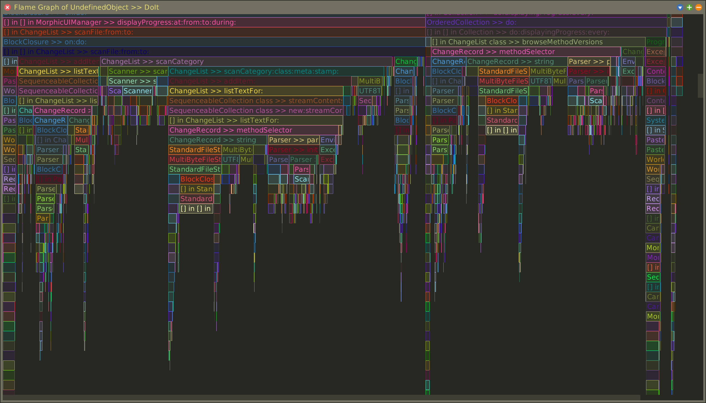
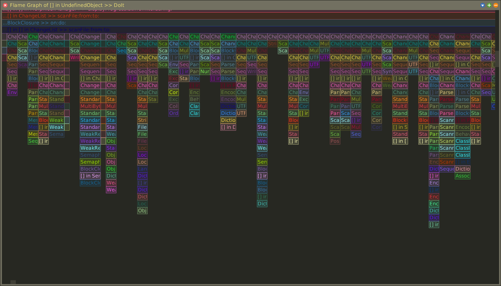

# Flame Graph for Squeak

## Installation

```smalltalk
Metacello new
	baseline: 'FlameGraph';
	repository: 'github://MariusDoe/squeak-flame-graph:main/src';
	get; load.
```

## Usage

```smalltalk
FlameGraph messageTallyOn: [ChangeList browseMethodVersions].
```


```smalltalk
FlameGraph leftHeavyMessageTallyOn: [ChangeList browseMethodVersions].
```


```smalltalk
FlameGraph profile: [ChangeList browseMethodVersions].
```


Scroll vertically and horizontally to navigate. Use <kbd>W</kbd> to zoom in and <kbd>S</kbd> to zoom out. Left-click to browse a method, shift-left-click to inspect the captured data.

Also search for preferences named _Flame Graph_ to adjust visuals.
